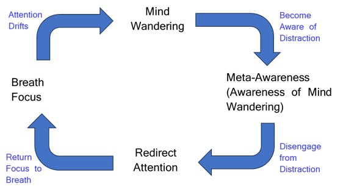
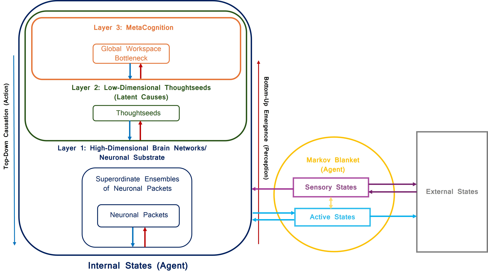

# Dual-Process Computational Model

A three-layer generative model of focused-attention meditation. It simulates expert and novice phenotypes across the canonical cycle of breath focus, mind wandering, meta-awareness, and redirect attention, then produces publication figures and saved JSON results for analysis.

One run per phenotype: a 12,000-step fit followed by an independent 4,000-step frozen rollout. The final 2,000 rollout steps supply the main figures.

After updating the model, rerun all five seeds before exporting manuscript results.
Plotting and export reject saved runs from older model versions.

---

## Quick Start

Install dependencies (uses `pyproject.toml`/`uv.lock`):

```bash
uv sync
```

or, without `uv`:

```bash
pip install -e .
```

Run the full pipeline:

```bash
python -m run_model run
```

Generate plots from existing saved results:

```bash
python -m run_model plot
```

To inspect another saved seed, render and export its matching manuscript macros
together (both commands overwrite the corresponding generated outputs):

```bash
python run_model.py plot --seed 101
python scripts/export_stats.py --seed 101
```

This project runs on CPU only; no GPU support is required or used.

---

## Architecture

 

- **Layer 1** (`substrate.py`): a neural generative process over seven large-scale networks (DMN, VAN, DAN, FPN, VIS, SOM, LIM) with four meditation regimes (BF, MW, MA, RA) and multivariate Ornstein-Uhlenbeck dynamics.
- **Layer 2** (`thoughtseeds.py`): compresses network dynamics into five thoughtseeds via closed-form Bayesian correction (no encoder network), and scores stay/switch policy candidates with a one-step pragmatic control/risk score -- no epistemic term.
- **Layer 3** (`policy.py`, `workspace.py`): fast, thresholded single-slot workspace access with reverberation and adaptation, plus slow graded meta-awareness ($m_t$), read as monitoring clarity. Its primary drive and top-down access bias come from the configured thoughtseed diagnosticity table; the drive is a log-odds contrast, not a calibrated observation likelihood. An empty slot contributes zero drive. Policy--habit discrepancy adds a further input to the monitor target: larger in experts in the evaluated runs, but in those runs never enough to produce a monitoring-threshold crossing during distractor broadcast, so it is not an independent detection trigger. An entry into the slot is an access event; meta-awareness weights policy evidence and biases access toward on-task content.
- MA detection: the first step during MA with `aha_moment` in the workspace and monitoring clarity at or above its threshold completes lapse detection. No new entry or threshold crossing is required. L2 retains that completion until MA ends and releases broadcast stabilization, restoring the existing phenotype-specific Gamma hazard. There is no extra exit clock or RA-only destination mass. Detection, MA regime identity, and graded meta-awareness are distinct.
- L1<->L2 blanket: network activity and dwell age upward; descending network predictions, policy-state probabilities, and broadcast hazard modulation downward. L2 incorporates detection-dependent release into that existing modulation signal.
- L2<->L3 blanket: state belief, dwell/habit/access priors, policy evidence, and thoughtseed activations upward; the selected policy posterior, broadcast winner, and meta-awareness downward.

### Model Summary

- States: BF, MW, MA, RA
- Networks: DMN, VAN, DAN, FPN, VIS, SOM, LIM
- Thoughtseeds: attend_breath, pain_discomfort, pending_tasks, aha_moment, equanimity

---

## Outputs

### Saved Results

Running the full pipeline writes one JSON file per phenotype to `data/`:

- `training_results_expert_seed104.json`
- `training_results_novice_seed104.json`

Each file contains the full 16,000-step run: state, network-activation, thoughtseed-activation, thoughtseed-prior-activation, free-energy, forward-error, meta-awareness, workspace-access, detection-event, and detection-completion histories, plus transition events and a model-version identifier.

### Generated Figures

Plots are written to `figures/`. All use the final 2,000 frozen-rollout steps except Fig. S1, which spans the full 16,000-step run and marks the frozen-rollout boundary (steps 12,001--16,000).

| File | Content |
|---|---|
| `FigS1_Convergence_{Expert,Novice}.pdf` | Free-energy and state-occupancy convergence over the full run |
| `fig3a.pdf` | State-conditional network activation profiles |
| `fig3b.pdf` | Dwell-time comparison by state |
| `fig3c.pdf` | Transition probability matrices |
| `fig4_workspace_access.pdf` | Per-phenotype workspace-content strip and meta-awareness trace over the concurrent L1 state sequence |
| `fig4_ignition_raster.pdf` | Fig. 4B threshold-raster view of meta-awareness episodes, marked MA detection events, and downstream Breath Focus follow-through |
| `fig5a.pdf` / `fig5b.pdf` | Novice / expert hierarchical traces (L3 meta-awareness, L2 thoughtseeds, L1 networks) |
| `fig6.pdf` | Pooled PCA projections of L2 thoughtseed and L1 network trajectories |

---

## Repository Layout

```text
.
+-- run_model.py                   # Main entry point (run | plot)
+-- experiments/
|   +-- training_pipeline.py       # Pinned SEED; fit + frozen-rollout orchestration
+-- config/
|   +-- defaults.py                # Core constants (states, networks, hyperparameters)
|   +-- profiles.py                # Phenotype dwell/transition/attractor tables
+-- model/
|   +-- training_loop.py           # Online simulation loop and result packaging
|   +-- phenotype.py               # Expert/novice phenotype definitions
|   +-- substrate.py               # Layer 1 MVOU dynamics
|   +-- thoughtseeds.py            # Layer 2 inference, decoder, forward model, policy scoring
|   +-- policy.py                  # Layer 3 policy arbitration
|   +-- workspace.py               # Layer 3 workspace-access and meta-awareness dynamics
|   +-- duration.py                # Regime-duration support and hazard
|   +-- markov_blankets.py         # Markov blanket interfaces
+-- utils/
|   +-- math_utils.py              # Shared tensor/math helpers
+-- viz/
|   +-- analysis_utils.py          # Tail-window statistics and aggregation
|   +-- convergence.py             # Fig. S1
|   +-- radar_plot.py              # Fig. 3A
|   +-- hierarchy.py               # Fig. 5
|   +-- attractors.py              # Fig. 6
|   +-- ignition.py                # Fig. 4 access measures and plot
|   +-- plotting_utils.py          # Shared plotting style/helpers
+-- scripts/
|   +-- export_stats.py            # Regenerates figures/stats.tex from the pinned-seed JSON
|   +-- aggregate_robustness.py    # Five-seed robustness table from data/*.json
+-- data/                          # Saved run outputs
+-- figures/                       # Generated and manuscript figure assets
+-- tests/
    +-- test_invariants.py             # Core invariants and numerical checks
    +-- test_reproducibility_smoke.py  # Fixed-seed determinism check
```

---

## Configuration

Edit `config/defaults.py` and `config/profiles.py` to modify:

- network/state parameters (`THETA_BASE`, network attractors)
- thoughtseed priors (`THOUGHTSEED_STATE_PRIORS`)
- Gamma dwell means and shared variability (`DWELL_MEAN_SECONDS`, `DWELL_CV`)
- transition priors (`STATE_TRANSITION_PROBS`)
- learning rates (`LEARNING_RATES`)
- numerical settings such as `NOISE_LEVEL`, `LATENT_TAU`, `PRACTICE_STEPS`, `EVALUATION_STEPS`, and `PLOT_STEPS`

---

## Reproducibility

The default (pinned figure) seed is fixed at 104, set by `SEED` in `experiments/training_pipeline.py`.

- `torch.manual_seed` and `np.random.seed` are set in the trainer
- Layer 1 uses its own seeded `RandomState`
- stochastic transitions and process noise are therefore reproducible under the same configuration and dependency environment

---
This repository builds on earlier Thoughtseeds-related codebases, including:

- https://github.com/prakash-kavi/thoughtseeds_vipassana
- https://github.com/prakash-kavi/viapssana_ts2
- https://github.com/prakash-kavi/aif_iwai2025_thoughtseeds
